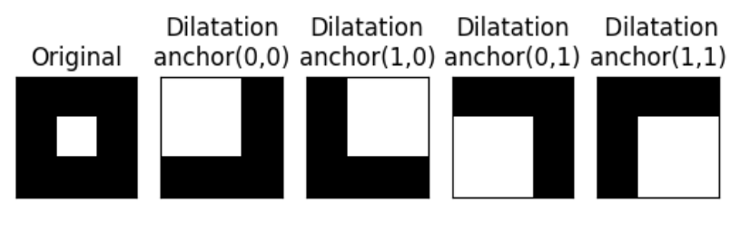
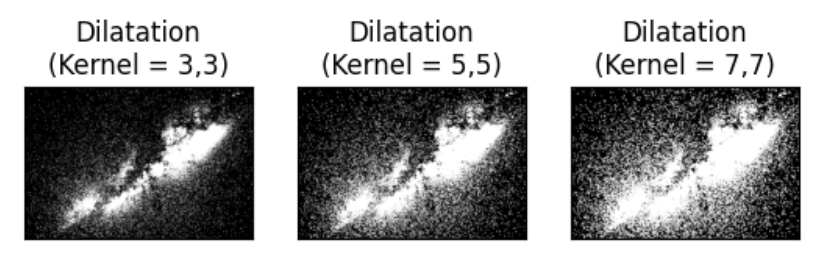
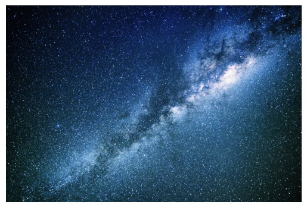
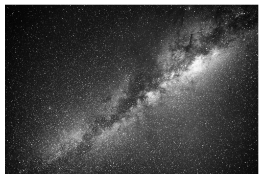
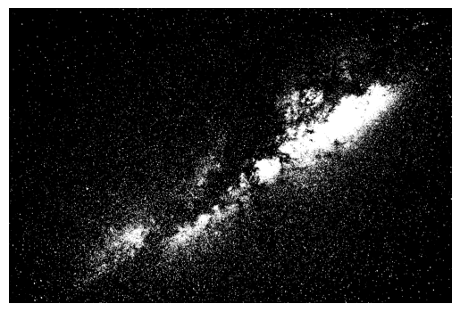
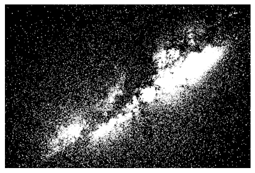
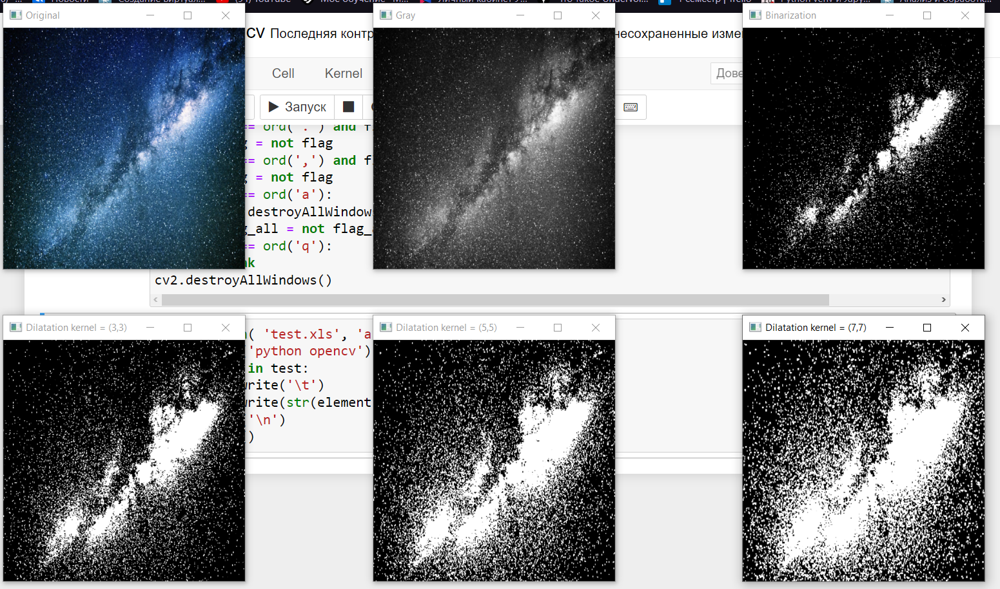
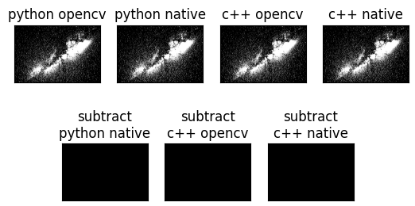

<h1 align="center">Лабораторная работа №1</h1>

<h2 align="center">Вариант 11. Дилатация изображения.</h2>


<h4>Теоритическая база</h4>

Дилатация (морфологическое "расширение" или "наращивание") – это операция определения локального максимума по некоторой окрестности, которая задается структурообразующим элементом (ядро, kernel). Обычно дилатация применяется к бинарным изображениям, но есть версии, которые работают с изображениями в градациях серого. Ядро может иметь произвольную форму и размер [1, 2]. При этом в ядре выделяется единственная ведущая позиция (anchor), которая совмещается с текущим пикселем при вычислении свертки. 
<figure>
  <p></p>
  <figcaption align="center"><i>Как меняется дилатация при разном параметре anchor в ядре 2х2</i></figcaption>
</figure><br><br>

Во многих случаях в качестве ядра выбирается  квадрат или круг с ведущей позицией в центре, которая делит ядро на две симметричные части (однако, как было сказано выше, форма у ядра может быть абсолютно любой и необязательно симметричной). Квадрат 3 × 3, вероятно, является наиболее распространенным структурирующим элементом, используемым в операциях расширения. Более крупный структурирующий элемент производит более выраженный эффект расширения, хотя обычно очень похожие эффекты могут быть достигнуты повторными расширениями с использованием меньшего структурирующего элемента аналогичной формы. С более крупными структурными элементами довольно часто используют структурирующий элемент дисковой формы, а не квадратной. 

<figure>
  <p></p>
  <figcaption align="center"><i>Дилатация с разным размером ядра в форме квадрата (3х3, 5х5, 7х7)</i></figcaption>
</figure><br><br>

Ядро можно рассматривать как шаблон или маску. Применение дилатации сводится к проходу шаблоном по всему изображению и применению оператора поиска локального максимума к интенсивностям пикселей изображения, которые, в дальнейшем, накрываются шаблоном. Основной эффект дилатаии на бинарном изображении заключается в постепенном увеличении границ областей пикселей переднего плана ( т. е., как правило, белых пикселей). Таким образом, области пикселей переднего плана увеличиваются в размерах, а отверстия в этих областях становятся меньше. Такая операция вызывает рост светлых областей на изображении и тем самым способствует объединению областей изображения, которые были разделены шумом и пр. Есть много специальных применений для дилатации. Например, его можно использовать для заполнения небольших ложных дыр ( "перцового шума" ) в изображениях. 

<h4>Описание разработанной системы</h4>

Принцип работы можно условно разделить на 5 пять этапов:
1) Загрузка изображения.
2) Преобразование изображения в градации серого.
3) Бинаризация изображения.
4) Дилатация изображения.
5) Вывод изображения после проведённых операций.

<b>Загрузка изобажения</b>
```
img = cv2.imread('space.jpg')
```
В качестве изображения используем снимок космоса со спутника.
<figure>
  <p align="center"></p>
  <figcaption align="center"><i>Исходное изображение</i></figcaption>
</figure><br><br>

<b>Преобразование изображения в градиции серого</b>
```
img_gray = cv2.cvtColor(img, cv2.COLOR_BGR2GRAY)
```
<figure>
  <p align="center"></p>
  <figcaption align="center"><i>Изображение в градациях серого</i></figcaption>
</figure><br><br>

<b>Бинаризация изображения</b> 
```
 ret,img_bin = cv2.threshold(img_gray,127,255,cv2.THRESH_BINARY)
```
<figure>
  <p align="center"></p>
  <figcaption align="center"><i>Изображение после бинаризации</i></figcaption>
</figure><br><br>

<b>Дилатация изображения</b>
```
img_dilation3 = cv2.dilate(img_bin, np.ones((3, 3), np.uint8), iterations=1)
```
Для дилатации используем ядро в виде квадрата размером 3х3, количество итераций – 1.
<figure>
  <p align="center"></p>
  <figcaption align="center"><i>Изображение после дилатации</i></figcaption>
</figure><br><br>

<b>Вывод изобржения</b> 
```
cv2.imshow('Dilatation kernel = (3,3)', cv2.resize (img_dilation3, dsize = (300, 300)))
```
 Выводим на экран изображение с помощью встроенной функции opencv, дополнительно уменьшаем изобжение.

<figure>
  <p align="center"></p>
  <figcaption align="center"><i>Вывод обработанного изображения</i></figcaption>
</figure><br><br>

<h4>Результаты работы и сравнения системы</h4>

Проведём дилатацию в трёх вариантах: Python openCV, Python native, C++ openCV, C++ native. Для того чтобы проверить, что все варианты дилатации на выходе получают одно и то же изображение, выполним операцию вычитания из варианта дилатации написанного на python opencv.

<figure>
  <p align="center"></p>
  <figcaption align="center"><i>Проверка корректности реализаций дилатации</i></figcaption>
</figure><br><br>

После вычитания получаем полностью чёрные изображения, следовательно все изображения дилатации, выполненные разными способами, полностью идентичны.
В каждом из вариантов мы проведём по 30 тестов и выясним среднее время выполнения дилатации.
Ниже приведены графики отношения времени к номеру теста для каждого из вариантов.

<figure>
  <p align="center"></p>
  <figcaption align="center"><i>Время на выполнение дилатации</i></figcaption>
</figure><br><br>


<figure>
  <p align="center"></p>
  <figcaption align="center"><i>Среднее время потраченное на выполнение дилатации</i></figcaption>
</figure><br><br>

Видно, что код написанный на нативном Python заметно уступает остальным вариантам. Следовательно, далее рассматривать нативный Python не имеет смысла. 
Сравним быстродействие библиотеки openCV на разных языках, а также нативного C++.
<figure>
  <p align="center"></p>
  <figcaption align="center"><i>Сравнения быстродействия</i></figcaption>
</figure><br><br>

На графиках видно, что самый эффективный вариант это язык С++ с использованием библиотеки opencv.

<h4>Выводы по работе</h4>

Вывод: для начального изучения библиотеки openCV идеально подходит язык Python т.к. он не строготипизированный и очень лёгок в обучении. Если мы хотим максимально оптимизировать код и ускорить его работу, необходимо использовать C++, потому что он заметно быстрее чем Python. 